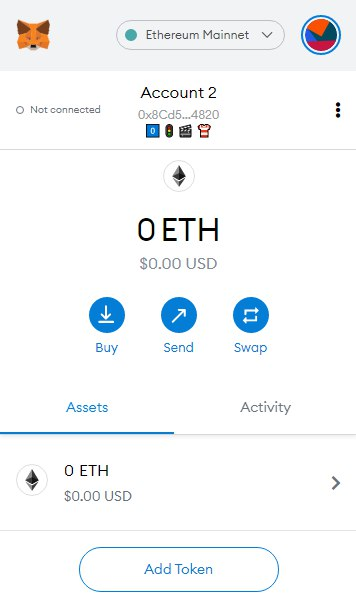

## Simple Summary
We propose a standard method for creating a digest of an Ethereum address represented as a series of emojis, which are human-friendly.

## Abstract
This ERC proposes a method to avoid address substitution attacks (such as [the recent one against the CEO of Nexus Mutual](https://twitter.com/nexusmutual/status/1338441873560571906)) by creating human readable digests of addresses composed of four simple emojis. These are easier for humans to recognize, remember and recount than hexadecimal strings, and would bring a number of security & usability benefits.

## Motivation
Mitigate attacks like [the recent one against CEO of Nexus Mutual](https://twitter.com/nexusmutual/status/1338441873560571906). Based on [Telegram's implementation for encrypted voice calls](https://core.telegram.org/api/end-to-end/voice-calls#key-verification). Address substiution is a common attack vector. Yet, showing only the first four and last four characters of an address is still a de-facto standard. There are some exising methods of visualising addresses as images with higher entropy than four emojis, however on a "human-readability" scale, the authors believe emojis to be much more user friendly. This would be easily implementable on different software and hardware wallets. Also, it would be very easy to send out-of-band i.e. via another means the same four emojis in order to verify the address. E.g. over a phone call, one could simple say "0, Traffic Lights, Film Clapperboard, T-Shirt" for 0️⃣ 🚦 🎬 👕.

## Specification
Using a [specific subset of emojis](./assets/emoji-list.json) which have been chosen based on uniqueness and based on Telegram's list:
 - create an scrypt hash of your address in hex (without the `0x` prefix), with the salt also equal to the same address bytes. *Should maybe think more about the salt...*
 - split this hash into chunks of 16 bytes
 - for each chunk mod the value by the length of the possible emojis to get an index
 - assign the emoji based on the calculated index
 - repeat for all hash chunks

## Rationale
 **TODO**.
The rationale fleshes out the specification by describing what motivated the design and why particular design decisions were made. It should describe alternate designs that were considered and related work, e.g. how the feature is supported in other languages.

## Backwards Compatibility
This is a new method of verifying addresses in a human-friendly manner and would not create any backwards compatibility issues.

## Reference Implementation
Requires python3 and scrypt (`pip3 install scrypt`).
```python
import scrypt
import json
import sys

def chunks(lst, n):
    for i in range(0, len(lst), n):
        yield lst[i:i + n]

if __name__ == "__main__":
    with open('./emoji-list.json') as emoji_list:
      data = json.load(emoji_list)
      emojis = list(data)

      address = bytes(bytearray.fromhex(sys.argv[1]))

      addr_hash = scrypt.hash(address, address)

      emoji_str = ""
      for i in chunks(addr_hash, 16):
          hash_chunk = int.from_bytes(i, "big")
          idx = hash_chunk % len(emojis)
          emoji_str += emojis[idx] + " "
      print(emoji_str)
```

Running:  
`python3 script.py 8Cd5fB2229fbB84E260dd03c392c9621CdDc4820`  
Outputs:  
0️⃣ 🚦 🎬 👕  

Which could look something like this in Metamask (mockup):  


Or on a hardware wallet:


## Security Considerations
 **TODO**.
All EIPs must contain a section that discusses the security implications/considerations relevant to the proposed change. Include information that might be important for security discussions, surfaces risks and can be used throughout the life cycle of the proposal. E.g. include security-relevant design decisions, concerns, important discussions, implementation-specific guidance and pitfalls, an outline of threats and risks and how they are being addressed. EIP submissions missing the "Security Considerations" section will be rejected. An EIP cannot proceed to status "Final" without a Security Considerations discussion deemed sufficient by the reviewers.

## Copyright
Copyright and related rights waived via [CC0](https://creativecommons.org/publicdomain/zero/1.0/).